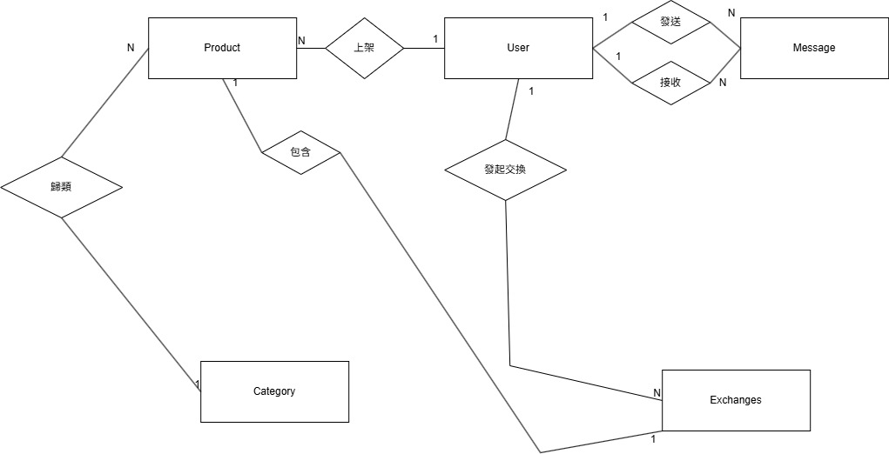

## 第11組 二手物品交換平台

---

## 應用情境
  小華為了活化家中閒置的物品，登入二手交換平台，透過分類搜尋找到感興趣的二手相機。他瀏覽商品詳情並與賣家透過內建訊息功能確認物品狀況後，發起交換請求。系統自動記錄雙方的交換意願與物品狀態，並將請求通知賣家。賣家收到通知後，透過平台確認並同意交換。雙方隨即約定時間完成面交，並在確認物品無誤後於系統上完成交易。
  
---

## 使用案例
### 使用者：
  1. **管理員**
      - 分類管理:管理員可以新增或刪除商品分類
      - 違規處理:管理員可以下架違規商品或停權違規帳號。
  2. **發起者(買家)**
      - 上架商品:接收者可以上傳商品照片、設定價格、描述商品，下架商品。
      - 交換管理:接收者可以查看發起端提供的物品資訊，並更新交換狀態。
      - 回覆訊息:接收者可以針對發起方的問題進行答覆。
   3. **接收者(賣家)**
      - 商品瀏覽: 系統須提供讓發起端選擇「自身一件物品」與「接收方一件物品」進行配對的功能 。
      - 發起交換請求:一旦發起交換，系統應自動鎖定（Lock）參與交換的兩件物品，防止其同時與他人達成其他交換紀錄。
      - 商品狀態追蹤: 使用者可查看交換狀態。
---

## 資料庫設計圖(ERDIAGRAM)]

 

### `users` -使用者資料表

  ```sql
CREATE TABLE Users (
    UserID INT PRIMARY KEY,
    Name VARCHAR(50) NOT NULL,
    Email VARCHAR(100) NOT NULL UNIQUE,
    Password VARCHAR(20) NOT NULL, 
    Account VARCHAR(20) NOT NULL,
    Role VARCHAR(10) NOT NULL,
    CONSTRAINT chk_role CHECK (Role IN ('admin', 'user')),
    CONSTRAINT chk_account_format CHECK (
        LENGTH(Account) BETWEEN 8 AND 10 AND 
        Account REGEXP '[A-Za-z]' AND 
        Account REGEXP '[0-9]'
    ),
    CONSTRAINT chk_password_format CHECK (
        LENGTH(Password) BETWEEN 8 AND 10 AND 
        Password REGEXP '[A-Za-z]' AND 
        Password REGEXP '[0-9]'
    )
);
  ```
| 欄位名稱 | 資料型別 | 中文說明 | 是否為空值 | 完整性限制 |
|----------|---------|-----------|----|--------------|
| `UserID` |   int   | 使用者編號 | 否 | PK |
| `Name`   | string | 使用者名字 | 否 | 使用者姓名格式 |
| `Email`  | string | 使用者電子信箱   | 否 | 唯一且符合電子郵件格式 |
| `Password` |   string  | 密碼 | 否 | 長度8~10至少包含一個英文字和數字 |
| `Account` |   string   | 帳號 | 否 | 長度8~10至少包含一個英文字和數字 |
| `Role` |  string   | 角色 | 否 | 只會是admin or user |

---

### `Category` -分類資料表

 ```sql
CREATE TABLE Category (
CategoryID INT PRIMARY KEY,
CategoryName VARCHAR(50) NOT NULL UNIQUE
);
  ```
| 欄位名稱 | 資料型別 | 中文說明 | 是否為空值 | 完整性限制 |
|----------|---------|-----------|----|--------------|
| `CategoryID` |   int   | 分類編號 | 否 | PK |
| `CategoryName`   | string | 分類名稱 | 否 | 唯一(Unique) |

---
### `Product` -商品資料表

 ```sql
CREATE TABLE Product (
    ProductID INT PRIMARY KEY,
    Title VARCHAR(100) NOT NULL,
    Description TEXT,
    Price DECIMAL(10, 2) NOT NULL,
    Status VARCHAR(20) NOT NULL,
    SellerID INT NOT NULL,
    CategoryID INT NOT NULL,
    CONSTRAINT chk_price_non_negative CHECK (Price >= 0),
    CONSTRAINT chk_status_values CHECK (Status IN ('上架中', '已交換', '已下架')),
    FOREIGN KEY (SellerID) REFERENCES Users(UserID),
    FOREIGN KEY (CategoryID) REFERENCES Category(CategoryID)
);
 ```
| 欄位名稱 | 資料型別 | 中文說明 | 是否為空值 | 完整性限制 |
|----------|---------|-----------|----|--------------|
| `ProductID` |   int   | 商品編號 | 否 | PK |
| `Description`   | string | 產品描述 | 否 | 無 |
| `SellerID`  | int | 賣家編號   | 否 | FK(關聯至User表) |
| `CategoryID` |   int  | 分類編號 | 否 | FK(關聯至Category表) |
| `Title` |   string   | 產品名稱 | 否 | 長度上限100個字 |
| `Price` |  decimal   | 產品價格 | 否 | >=0 |
| `Status` |  string   | 產品價格 | 否 | 上架中，以交換，以下架 |

---
### `Message` -訊息資料表
  ```sql
CREATE TABLE Message (
MessageID INT PRIMARY KEY,
SenderID INT NOT NULL,
ReceiverID INT NOT NULL,
ProductID INT NOT NULL,
Content TEXT NOT NULL,
SentTime DATETIME DEFAULT CURRENT_TIMESTAMP,
FOREIGN KEY (SenderID) REFERENCES Users (UserID),
FOREIGN KEY (ReceiverID) REFERENCES Users (UserID),
FOREIGN KEY (ProductID) REFERENCES Product (ProductID)
);

  ```
| 欄位名稱 | 資料型別 | 中文說明 | 是否為空值 | 完整性限制 |
|----------|---------|-----------|----|--------------|
| `MessageID` |   int   | 訊號編號 | 否 | PK |
| `SenderID`   | int | 發送者編號 | 否 | FK(關聯至User表) |
| `ReceiverID`  | int | 接收者編號   | 否 | FK(關聯至User表) |
| `ProductID` |   int  | 關聯產品邊號 | 否 | FK(關聯至Product表) |
| `Content` |   decimal   | 訊息內容 | 否 | 須包含文字不可為空 |
| `SentTime` |  datetime   | 發送時間 | 否 | 系統當前時間 |
---
### `Exchanges` -交換資料表
  ```sql
CREATE TABLE Exchanges (
ExchangesID INT PRIMARY KEY,
ProposerUserID INT NOT NULL,
ProposerProductID INT NOT NULL,
ReceiverProductID INT NOT NULL,
OrderDate DATETIME DEFAULT CURRENT_TIMESTAMP,
Status VARCHAR(20) NOT NULL,
CONSTRAINT chk_exchange_status CHECK (Status IN ('待確認','已同意','已拒绝','已完成')),
FOREIGN KEY (ProposerUserID) REFERENCES Users (UserID),
FOREIGN KEY (ProposerProductID) REFERENCES Product (ProductID),
FOREIGN KEY (ReceiverProductID) REFERENCES Product (ProductID)
);

  ```
| 欄位名稱 | 資料型別 | 中文說明 | 是否為空值 | 完整性限制 |
|----------|---------|-----------|----|--------------|
| `ExchangesID` |   int   | 訊號編號 | 否 | PK |
| `ProposerUserID`   | int | 發起者編號 | 否 | FK(關聯至User表) |
| `ProposerProductID`  | int | 提出者提供的物品編號  | 否 | FK(關聯至Product表) |
| `ReceiverProductID` |   int  | 對方物品編號 | 否 | FK(關聯至Product表) |
| `OrderDate` |   datetime   | 訊息內容 | 否 | 預設為系統當前時間 |
| `Status` |  string   | 發送時間 | 否 | 例如：待確認、已同意、已拒絕、已完成 |
---

## 關係介紹

  

  - users ↔️ orders：一位使用者可以有多筆訂單 → 一對多（1:N）
  - orders ↔️ order_items：一筆訂單可以包含多杯飲料 → 一對多（1:N）
  - order_items ↔️ drinks：每個訂單項目對應一種飲料品項 → 多對一（N:1）
  - order_items ↔️ order_item_add_ons：每杯飲料可以選多種加料 → 一對多（1:N）
  - order_item_add_ons ↔️ add_ons：每筆加料項目指向一種加料類型 → 多對一（N:1）

---

