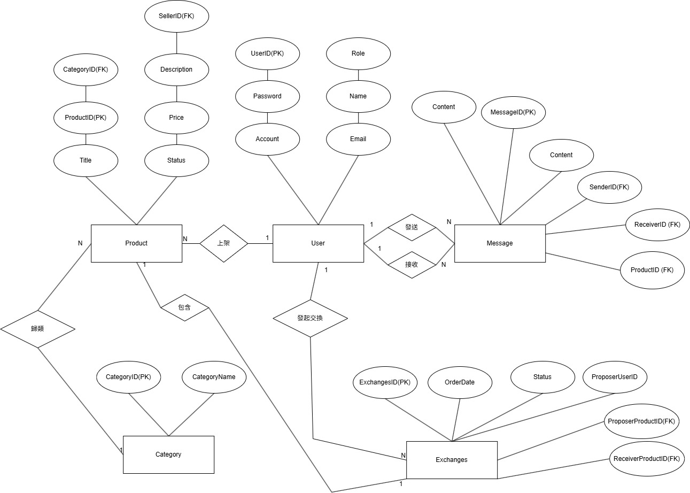

## 第11組 二手物品交換平台

---

## 應用情境
  小華為了活化家中閒置的物品，登入二手交換平台，透過分類搜尋找到感興趣的二手相機。他瀏覽商品詳情並與賣家透過內建訊息功能確認物品狀況後，發起交換請求。系統自動記錄雙方的交換意願與物品狀態，並將請求通知賣家。賣家收到通知後，透過平台確認並同意交換。雙方隨即約定時間完成面交，並在確認物品無誤後於系統上完成交易。
  
---

## 使用案例
### 使用者：
  1. **管理員**
      - 分類管理:管理員可以新增或刪除商品分類
      - 違規處理:管理員可以下架違規商品或停權違規帳號。
  2. **發起者(買家)**
      - 上架商品:接收者可以上傳商品照片、設定價格、描述商品，下架商品。
      - 交換管理:接收者可以查看發起端提供的物品資訊，並更新交換狀態。
      - 回覆訊息:接收者可以針對發起方的問題進行答覆。
   3. **接收者(賣家)**
      - 商品瀏覽: 系統須提供讓發起端選擇「自身一件物品」與「接收方一件物品」進行配對的功能 。
      - 發起交換請求:一旦發起交換，系統應自動鎖定（Lock）參與交換的兩件物品，防止其同時與他人達成其他交換紀錄。
      - 商品狀態追蹤: 使用者可查看交換狀態。
---

## 資料庫設計圖(ERDIAGRAM)]

 

### `users` -使用者資料表

  ```sql
CREATE TABLE Users (
    UserID INT PRIMARY KEY,
    Name VARCHAR(50) NOT NULL,
    Email VARCHAR(100) NOT NULL UNIQUE,
    Password VARCHAR(20) NOT NULL, 
    Account VARCHAR(20) NOT NULL,
    Role VARCHAR(10) NOT NULL,
    CONSTRAINT chk_role CHECK (Role IN ('admin', 'user')),
    CONSTRAINT chk_account_format CHECK (
        LENGTH(Account) BETWEEN 8 AND 10 AND 
        Account REGEXP '[A-Za-z]' AND 
        Account REGEXP '[0-9]'
    ),
    CONSTRAINT chk_password_format CHECK (
        LENGTH(Password) BETWEEN 8 AND 10 AND 
        Password REGEXP '[A-Za-z]' AND 
        Password REGEXP '[0-9]'
    )
);
  ```
| 欄位名稱 | 資料型別 | 中文說明 | 是否為空值 | 完整性限制 |
|----------|---------|-----------|----|--------------|
| `UserID` |   int   | 使用者編號 | 否 | PK |
| `Name`   | string | 使用者名字 | 否 | 使用者姓名格式 |
| `Email`  | string | 使用者電子信箱   | 否 | 唯一且符合電子郵件格式 |
| `Password` |   string  | 密碼 | 否 | 長度8~10至少包含一個英文字和數字 |
| `Account` |   string   | 帳號 | 否 | 長度8~10至少包含一個英文字和數字 |
| `Role` |  string   | 角色 | 否 | 只會是admin or user |

---

