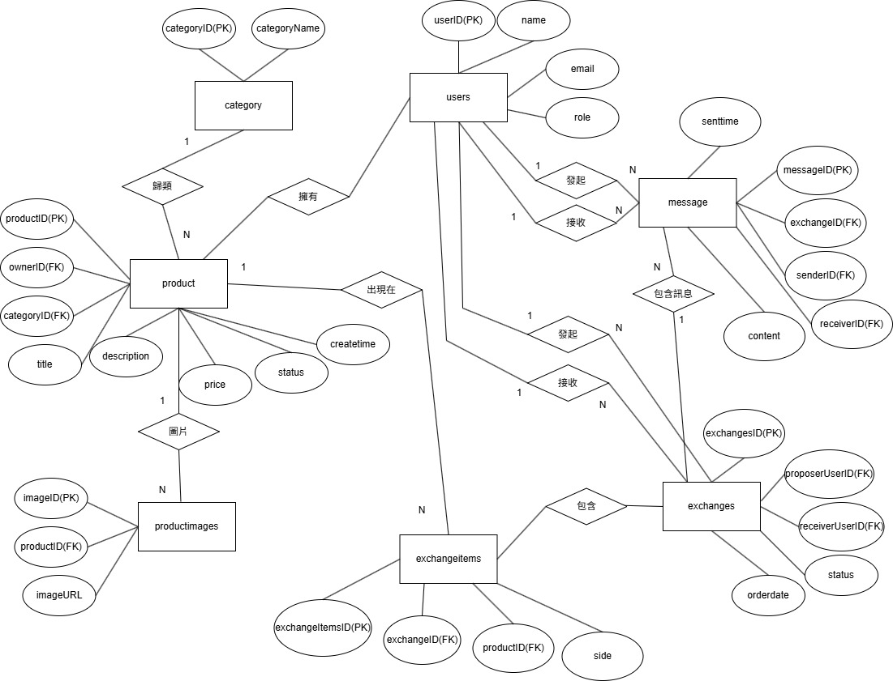
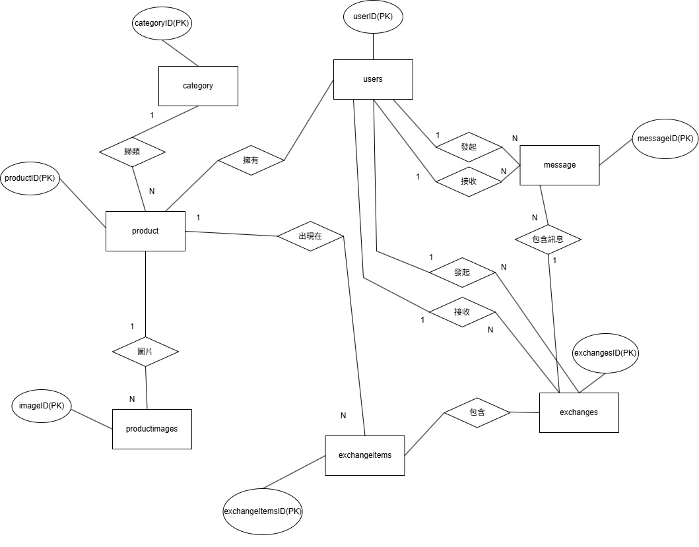

第11組 二手物品交換平台
---
[期末報告ppt](https://canva.link/gnlxj48w45zk4ok) 。
---
[期末報告word](二手物品交換平台word.pdf) 。
---

| 姓名 | 學號 |心得|
|------|------|------|
| 余家豪 | 41243116 |  資料庫系統對我來說是一個從會寫程式的學生到軟體工程師的第一部也是非常重要的一步，其實生活中常常會使用到資料庫但我們卻渾然不覺，經過這一學期的課程以及這次期末專題，我從一開始的一竅不知到如今已略懂資料庫系統運作，可以與組員一同設計一個二手物品交換平台的資料庫以及它的運作邏輯，我想這對我未來面對更大型的專案有更多自信可以完成，感謝老師一學期的教導。
| 楊承哲 | 41243147 |在這學期學到了很多設計、管理資料庫時要注意的事情，資料庫沒有我想的那麼難，但有很多眉眉角角要注意，透過這學期的課程讓我在以後再遇到類似的情況可以避免再犯下一樣的錯誤。

---


## 應用情境
  小華為了活化家中閒置的物品，登入二手交換平台，透過分類搜尋找到感興趣的二手相機。他瀏覽商品詳情並與賣家透過內建訊息功能確認物品狀況後，發起交換請求。系統自動記錄雙方的交換意願與物品狀態，並將請求通知賣家。賣家收到通知後，透過平台確認並同意交換。雙方隨即約定時間完成面交，並在確認物品無誤後於系統上完成交易。
  
---

## 使用案例
### 使用者：
  1. **管理員**
      - 分類管理:管理員可以新增或刪除商品分類
      - 違規處理:管理員可以下架違規商品或停權違規帳號。
  2. **接收者(賣家)**
      - 上架商品:接收者可以上傳商品照片、設定價格、描述商品，下架商品。
      - 交換管理:接收者可以查看發起端提供的物品資訊，並更新交換狀態。
      - 回覆訊息:接收者可以針對發起方的問題進行答覆。
   3. **發起者(買家)**
      - 商品瀏覽: 系統須提供讓發起端選擇「自身一件或多件物品」與「接收方物品」進行配對的功能 。
      - 商品狀態追蹤: 使用者可查看交換狀態。
---

## 資料庫設計圖(ERDIAGRAM)

 

### `users` -使用者資料表

  ```sql
CREATE TABLE Users (
    UserID INT PRIMARY KEY AUTO_INCREMENT,
    Name VARCHAR(50) NOT NULL,
    Email VARCHAR(100) NOT NULL UNIQUE,
    Role VARCHAR(10) NOT NULL,

    CONSTRAINT chk_user_email_format
        CHECK (Email REGEXP '^[A-Za-z0-9._%+-]+@[A-Za-z0-9.-]+[.][A-Za-z]{2,}$'),

    CONSTRAINT chk_user_role
        CHECK (Role IN ('admin', 'user'))
) ;
  ```
| 欄位名稱 | 資料型別 | 中文說明 | 是否為空值 | 完整性限制 |
|----------|---------|-----------|----|--------------|
| `UserID` |   int   | 使用者編號 | 否 | PK |
| `Name`   | string | 使用者名字 | 否 | 使用者姓名格式 |
| `Email`  | string | 使用者電子信箱   | 否 | 唯一且符合電子郵件格式 |
| `Role` |  string   | 角色 | 否 | 只會是admin or user |

---

### `Category` -分類資料表

 ```sql
CREATE TABLE Category (
    CategoryID INT PRIMARY KEY AUTO_INCREMENT,
    CategoryName VARCHAR(50) NOT NULL UNIQUE
) ;
  ```
| 欄位名稱 | 資料型別 | 中文說明 | 是否為空值 | 完整性限制 |
|----------|---------|-----------|----|--------------|
| `CategoryID` |   int   | 分類編號 | 否 | PK |
| `CategoryName`   | string | 分類名稱 | 否 | 唯一(Unique) |

---
### `Product` -商品資料表

 ```sql
CREATE TABLE Product (
    ProductID INT PRIMARY KEY AUTO_INCREMENT,
    OwnerID INT NOT NULL,
    CategoryID INT NOT NULL,
    Title VARCHAR(100) NOT NULL,
    Description TEXT,
    Price DECIMAL(10, 2) NOT NULL,
    Status VARCHAR(20) NOT NULL DEFAULT '可交換',
    CreatedAt DATETIME NOT NULL DEFAULT CURRENT_TIMESTAMP,

    CONSTRAINT chk_product_price
        CHECK (Price >= 0),

    CONSTRAINT chk_product_status
        CHECK (Status IN ('可交換', '交換中', '已交換', '已下架')),

    FOREIGN KEY (OwnerID) REFERENCES Users(UserID),
    FOREIGN KEY (CategoryID) REFERENCES Category(CategoryID)
) ;
 ```

| 欄位名稱 | 資料型別 | 中文說明 | 是否為空值 | 完整性限制 |
|----------|---------|-----------|----|--------------|
| `ProductID` |   int   | 商品編號 | 否 | PK |
| `OwnerID`  | int | 擁有者編號   | 否 | FK(關聯至User表) |
| `CategoryID` |   int  | 分類編號 | 否 | FK(關聯至Category表) |
| `Title` |   string   | 產品名稱 | 否 | 長度上限100個字 |
| `Description`   | string | 產品描述 | 否 | 無 |
| `Price` |  decimal   | 產品價格 | 否 | >=0 |
| `Status` |  string   | 商品狀態 | 否 | 可交換，已交換，已下架 |
| `CreatedAt` | DATETIME  | 建立時間 | 否 | 預設為系統當前時間 |

---
### `ProductImages` -商品圖片資料表

  ```sql
CREATE TABLE ProductImages (
    ImageID INT PRIMARY KEY AUTO_INCREMENT,
    ProductID INT NOT NULL,
    ImageURL VARCHAR(255) NOT NULL,

    FOREIGN KEY (ProductID) REFERENCES Product(ProductID)
) ;
  ```
| 欄位名稱 | 資料型別 | 中文說明 | 是否為空值 | 完整性限制 |
|----------|---------|-----------|----|--------------|
| `ImageID` |   int   | 圖片編號 | 否 | PK |
| `ProductID`   | int | 產品編號 | 否 | FK(關聯至Product表) |
| `ImageURL`  | varchar | 圖片路徑  | 否 | 無 |

---
### `Message` -訊息資料表
  ```sql
CREATE TABLE Message (
    MessageID INT PRIMARY KEY AUTO_INCREMENT,
    SenderID INT NOT NULL,
    ReceiverID INT NOT NULL,
    ProductID INT NOT NULL,
    Content TEXT NOT NULL,
    SentTime DATETIME NOT NULL DEFAULT CURRENT_TIMESTAMP,

    FOREIGN KEY (SenderID) REFERENCES Users(UserID),
    FOREIGN KEY (ReceiverID) REFERENCES Users(UserID),
    FOREIGN KEY (ProductID) REFERENCES Product(ProductID)
);

  ```
| 欄位名稱 | 資料型別 | 中文說明 | 是否為空值 | 完整性限制 |
|----------|---------|-----------|----|--------------|
| `MessageID` |   int   | 訊息編號 | 否 | PK |
| `SenderID`   | int | 發送者編號 | 否 | FK(關聯至User表) |
| `ReceiverID`  | int | 接收者編號   | 否 | FK(關聯至User表) |
| `ProductID` |   int  | 產品邊號 | 否 | FK(關聯至Product表) |
| `Content` |   text   | 訊息內容 | 否 | 須包含文字不可為空 |
| `SentTime` |  datetime   | 發送時間 | 否 | 系統當前時間 |
---
### `Exchanges` -交換資料表
  ```sql
CREATE TABLE Exchanges (
    ExchangeID INT PRIMARY KEY AUTO_INCREMENT,
    ProposerUserID INT NOT NULL,
    ReceiverUserID INT NOT NULL,
    OrderDate DATETIME NOT NULL DEFAULT CURRENT_TIMESTAMP,
    Status VARCHAR(20) NOT NULL DEFAULT '待確認',

    CONSTRAINT chk_exchange_status
        CHECK (Status IN ('待確認', '已同意', '已拒絕', '已完成')),

    CONSTRAINT chk_exchange_different_users
        CHECK (ProposerUserID <> ReceiverUserID),

    FOREIGN KEY (ProposerUserID) REFERENCES Users(UserID),
    FOREIGN KEY (ReceiverUserID) REFERENCES Users(UserID)
);

  ```
| 欄位名稱 | 資料型別 | 中文說明 | 是否為空值 | 完整性限制 |
|----------|---------|-----------|----|--------------|
| `ExchangesID` |   int   | 交換編號 | 否 | PK |
| `ProposerUserID`   |  int | 發起者編號 | 否 | FK(關聯至User表) |
| `ReceiverID` |   int  | 對方物品編號 | 否 | FK(關聯至Product表) |
| `OrderDate` |   datetime   | 訂單日期 | 否 | 預設為系統當前時間 |
| `Status` |  varchar   | 交易狀態 | 否 | 例如：待確認、已同意、已拒絕、已完成 |
---
### `ExchangeItems` -交換物品資料表
  ```sql
CREATE TABLE ExchangeItems (
    ExchangeItemID INT PRIMARY KEY AUTO_INCREMENT,
    ExchangeID INT NOT NULL,
    ProductID INT NOT NULL,
    Side VARCHAR(20) NOT NULL,

    CONSTRAINT chk_exchange_item_side
        CHECK (Side IN ('發起方', '接收方')),

    CONSTRAINT uq_exchange_product
        UNIQUE (ExchangeID, ProductID),

    FOREIGN KEY (ExchangeID) REFERENCES Exchanges(ExchangeID),
    FOREIGN KEY (ProductID) REFERENCES Product(ProductID)
) ;

  ```
| 欄位名稱 | 資料型別 | 中文說明 | 是否為空值 | 完整性限制 |
|----------|---------|-----------|----|--------------|
| `exchangeItemID` |   int   | 物品交換編號 | 否 | PK |
| `exchangeID`   | int | 交換編號 | 否 | FK(關聯至exchange表) |
| `ProductID` |   int  | 商品編號 | 否 | FK(關聯至Product表) |
| `side` |   varchar   | 角色 | 否 | 例如:發起方，接收方 |

---
## 關係介紹

  

- category 1 —— N product：歸類
- users 1 —— N product：擁有
- product 1 —— N productimages：擁有圖片
- users 1 —— N exchanges：發起
- users 1 —— N exchanges：接收
- exchanges 1 —— N exchangeitems：包含
- product 1 —— N exchangeitems：出現在
- exchanges 1 —— N message：包含訊息
- users 1 —— N message：發送
- users 1 —— N message：接收


---
## view
view查看某筆交換包含哪些商品
  ```sql
CREATE VIEW View_User_AvailableProducts AS
SELECT
    p.ProductID,
    p.Title,
    p.Description,
    p.Price,
    p.Status,
    p.CreatedAt,
    u.UserID AS OwnerID,
    u.Name AS OwnerName,
    c.CategoryName,
    pi.ImageURL
FROM Product p
JOIN Users u ON p.OwnerID = u.UserID
JOIN Category c ON p.CategoryID = c.CategoryID
LEFT JOIN ProductImages pi ON p.ProductID = pi.ProductID
WHERE p.Status = '可交換';
```
---


這裡只查USER1跟2的交易
可以看到李小美想要用小孩玩具與資料庫課本向王小明交換相機

---
view後台統計
  ```sql
CREATE VIEW View_Admin_DashboardSummary AS
SELECT
    (SELECT COUNT(*) FROM Users) AS TotalUsers,
    (SELECT COUNT(*) FROM Product) AS TotalProducts,
    (SELECT COUNT(*) FROM Category) AS TotalCategories,
    (SELECT COUNT(*) FROM Exchanges) AS TotalExchanges,
    (SELECT COUNT(*) FROM Message) AS TotalMessages,
    (SELECT COUNT(*) FROM Product WHERE Status = '可交換') AS AvailableProducts,
    (SELECT COUNT(*) FROM Product WHERE Status = '交換中') AS ExchangingProducts,
    (SELECT COUNT(*) FROM Exchanges WHERE Status = '待確認') AS PendingExchanges,
    (SELECT COUNT(*) FROM Exchanges WHERE Status = '已完成') AS CompletedExchanges;
```
---


可以看到各項數據統計，例如使用者數量 商品數量。

---
view查看可交換物品(user) 
 ```sql
CREATE VIEW View_User_AvailableProducts AS
SELECT
    p.ProductID,
    p.Title,
    p.Description,
    p.Price,
    p.Status,
    p.CreatedAt,
    u.UserID AS OwnerID,
    u.Name AS OwnerName,
    c.CategoryName,
    pi.ImageURL
FROM Product p
JOIN Users u ON p.OwnerID = u.UserID
JOIN Category c ON p.CategoryID = c.CategoryID
LEFT JOIN ProductImages pi ON p.ProductID = pi.ProductID
WHERE p.Status = '可交換';
```
---

